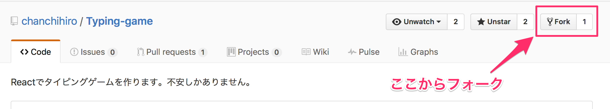
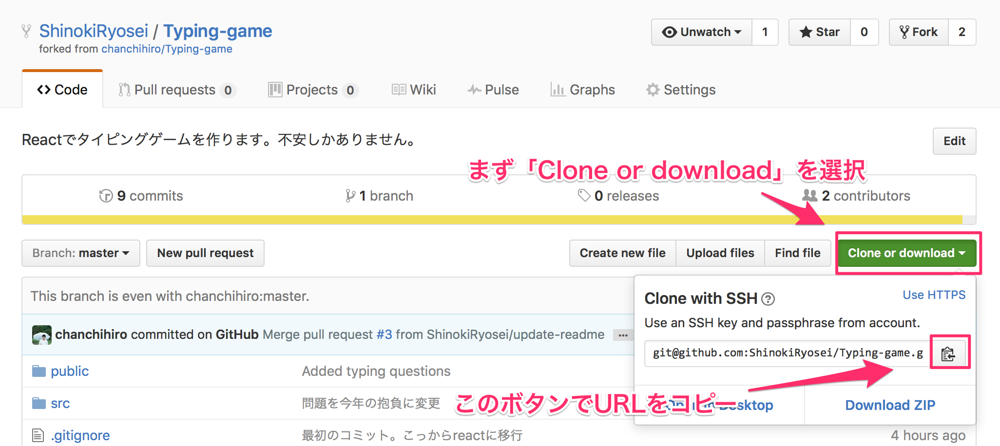
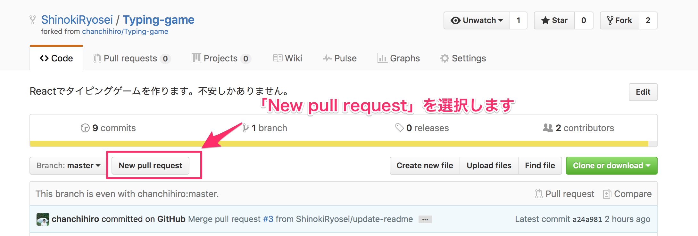
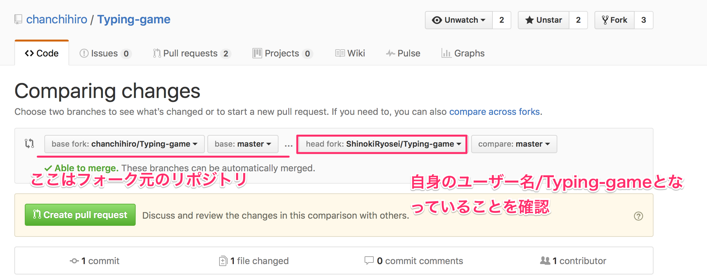
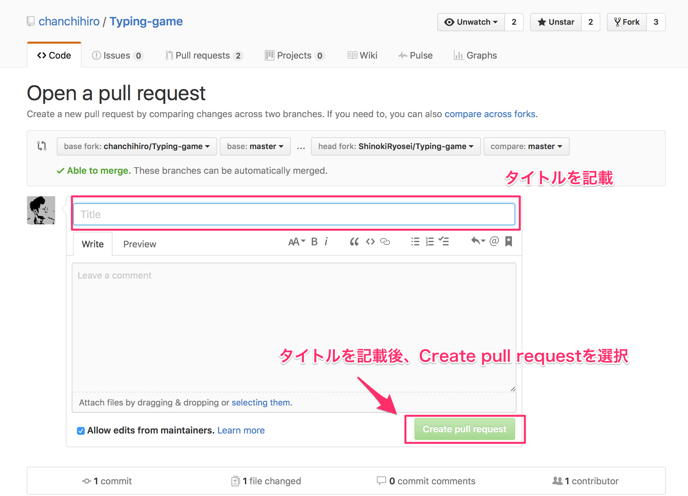

# 概要
Reactでタイピングゲームを作ります。
作れる気がしません。
そもそもReactはタイピングゲームに向いているのでしょうか。

# プルリクをください
`public/js/type.js`の最後のjson部分に以下の事項を追加してプルリクください。

- 2017年の抱負
- 抱負のカタカナ表記
- 名前

## フォーマット
`public/js/type.js`の最後尾`Typing.datas = []`の中に以下のフォーマットで抱負を追加してください。
```
{
  question　: "2017年の抱負",
  kana : "ホウフノカタカナヒョウキ",
  comment : "自身の名前"
}
```
### 例
```
{
  question : "筋肉つける",
  kana : "キンニクツケル",
  comment : "ちゃんちー"
}
```

## プルリクの出し方
※以下のやり方は、GitHubのアカウントがある前提で進めます。登録をされてない方は次の記事を参考に登録してください。[GitHubアカウント作成とリポジトリの作成手順](http://qiita.com/kooohei/items/361da3c9dbb6e0c7946b)

1.まずGitHubでこのリポジトリをフォーク(fork)します。画面の右上のforkボタンよりフォークしてください。フォークすると、フォークした自分のリポジトリの画面になります。


2.次にフォーク(fork)したリポジトリをクローンします。"Clone or download"からリポジトリのURLを表示し、そのURLをコピーします。


3.次にターミナルを起動します。`Terminal.app`をFinderの`アプリケーション`から選択して起動してください。

4.次にターミナルで、クローンする先にディレクトリ移動をします。以下のコマンドを打ちます。今回はデスクトップにクローンします。
```
cd Desktop
```

5.クローン先にディレクトリに移動した後(今回はデスクトップに移動した後)、先ほどコピーしたURLを`git clone`というコマンドの後にペーストします。
```
git clone <コピーしたURL>
```

例えば次のような形になります。
```
git clone https://github.com/ShinokiRyosei/Typing-game.git
```

あとは、エンターを押してコマンドを実行すれば、クローンされます。

6.次に、クローンしたプロジェクトにディレクトリ移動します。以下のコマンドです。
```
cd Typing-game
```

7.では、`public/js/type.js`を編集しましょう。テキストエディターやMac標準アプリの`TextEdit.app`で`type.js`を編集します。上記のフォーマットに従って、編集した後、保存しておきます。

8.ターミナルで次のコマンドを順番に打っていきます。
```
git add public/js/type.js
```

次に、
```
git commit -m"Added new json data"
```

最後に、
```
git push origin master
```

これでGitHubの自身のリポジトリには変更が保存されます。

9.次にPull request(プルリクエスト、以下プルリク)を出しましょう。
GitHubのページからプルリクを作成します。`New pull request`を選択します。


10.プルリクエストの際にフォーク元のリポジトリと自身のリポジトリを選択して、`New pull request`を選択します。


11.タイトルと適宜説明を追加し、`Create pull request`を選択します。

以上で、あとはマージされるのを待つだけです。😄
